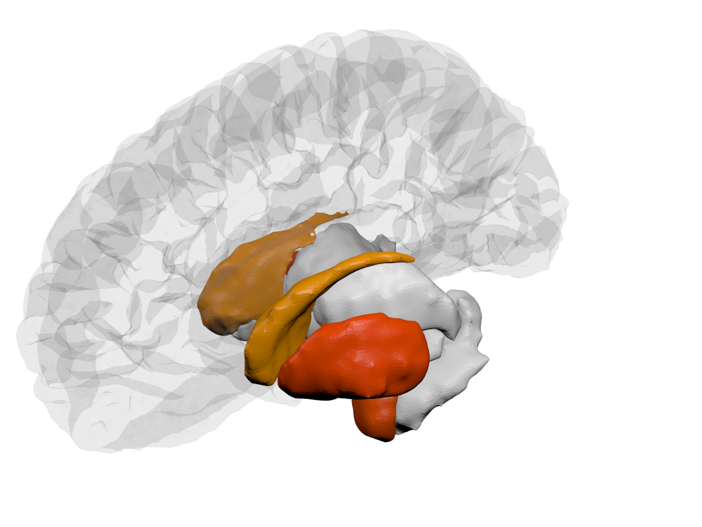

INPUT:

Image | hippocampus | superior frontal | inferior occipital
:-------------------------:|:-------------------------:
Pathology Img 1| 0.1 | 2.3 | 4.5

OUTPUT:
Cortical surface           |  Subcortical structures
:-------------------------:|:-------------------------:
  |   

# Brain colouring software 
Author: Razvan V. Marinescu - razvan@csail.mit.edu


# Installation

## Using the Docker container

In order to remove the need to install blender and the python libraries, we made a container which has blender and this repository already pre-installed and ready to run.

1. Install Docker for your current operating system. For MacOS use this link:
https://docs.docker.com/v17.12/docker-for-mac/install/#download-docker-for-mac

Make sure you run the docker deamon after installing. To check if it installer properly, run:

``` docker info```

If prompted to make an account with dockerhub, skip as you don't need one.

2. Download the docker image with the bundled blender and brain coloring software using:
 ``` docker run -it mrazvan22/brain-coloring ```

The image size may be large (~1GB), so use a good connection. Note that after the download, it will automatically connect to the container. If it connected successfully, you should see the shell as follows:

``` root@e3b175e886db:/# ```

3. Go to the directory and run make

``` cd /home/brain-coloring/ ```

Run the software using the Makefile command:

``` make ```

If successful, you should see the images in output/pcaCover being updated. 

## Using the software

1. simply generate the list of pathology numbers according to the format in data/pcaCover.csv  

1.1 If using docker, copy your input.csv representing pathology values to the docker container 

``` sudo docker cp input.csv 9f52258c25f6:/home/brain-coloring/data```

Here, replace 9f52258c25f6 with your container-ID, which you can find by running on host:

``` docker ps 

CONTAINER ID        IMAGE                      COMMAND     
e3b175e886db        mrazvan22/brain-coloring   "/bin/bash"
```

2. change configuration file config.py
	- input file: set to your input file
	- brain type: pial or inflated
	- image type: cortical or subcortical
	- colours to show pathology
	- the mapping between your atlas the 3D brain regions that will be coloured
	- image resolution, etc ...
	
3. re-generate images using the Makefile command
	
	``` make ```

3.1. If using docker, copy the image out of the docker container to the home directory ~/ :

``` sudo docker cp <yourContainerID>:/home/brain-coloring/output/pcaCover/cortical_0.png ~/ ```

